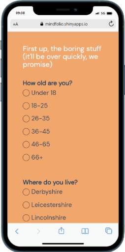
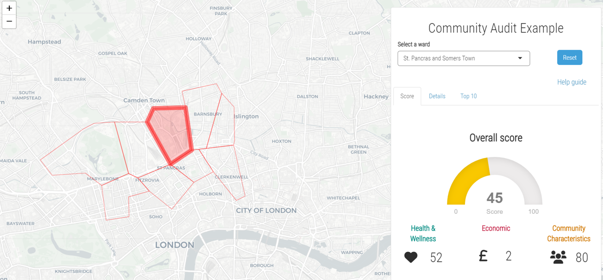

<h2>Data-driven story teller</h2>

 

<i class="fa fa-angle-double-down"></i>

 
 
<h2>About</h2>
<h4>Currently, I am a Senior Research Manager at <a href="https://www.vansonbourne.com/" target="_blank">Vanson Bourne</a>, a B2B market research agency based in the UK. My role involves managing the end-to-end running of market research projects. Distilling complex topics into compelling data-driven insight narratives.

I bring my data-driven stories to life using engaging or interactive infographics, web apps or dashboard, and create these using tools such as R Shiny and Plotly. 

Prior to joining Vanson Bourne, I was Head of Data Science for <a href="https://www.mindfolio.com/" target="_blank">MindFolio</a>, a boutique management consultancy. I also hold a PhD from the University of Zurich, in behavioural science.</h4>

 
 

<h2>Industry skills</h2>
<h4>
behavioural research  
concept development | visioning 
consumer/market research | brand research | research for content 
end-to-end project management 
line management
</h4>

 
 

<h2>Technical skills</h2>

<h3>Research techniques</h3>
<h4>
survey design/programming 
quant & qual 
maxdiff | conjoint
</h4>

<h3>Analytical techniques</h3>
<h4>
base statistical techniques | clustering/segmentation | ML 
sentiment analysis | NLP | topic modelling
</h4>

<h3>R</h3>
<h4>
shiny | markdown 
ggplot2 | plotly | leaflet 
tidyverse 
API's | webscraping
<h4>

<h3>Other skills</h3>
<h4>
html | css | javascript 
Git | GitHub 
Netlify | MongoDB
</h4>

 
 
<h2>Projects</h2>
<h4>From creating a unique bespoke survey platform to a tool to analyse community health, I have worked on a range of development-led data projects, bringing a unique perspective on how data is presented/used</h4>

 

<table>
 <tr>
 <td style="padding-right: 10px;">
 
 </td>
  <td>
 
 </td>
 </tr>
 </table>

 
<h4>
You can find an example of one of my creations <a href="https://mindfolio.shinyapps.io/Community-Audit/" target="blank_">here</a> (works best on desktop) - a big data app which uses over 20 variables across London wards to get an understanding of community health. You can read more about the tool in this article for TechUK <a href="https://www.techuk.org/resource/the-power-of-big-data-in-understanding-shaping-community-development2.html" target="blank_">here</a>.
 
 
Using my background in behavioural science, I have also helped innovate and develop MindFolio's Place Attachment insights system. This tool combines allows us to measure people's emotional connections to a place and where improvements are needed to help create more wholesome communities. You can find more details <a href="https://mindfolio.com/place-attachment-insight-system-to-create-lasting-communities/" target="blank_">here</a>.</h4>
 

 

<h2>Open source projects</h2>
<h4>
<a href="https://github.com/JamieSamson">Click here</a> to visit my GitHub profile for some open source R projects I have written</h4>

